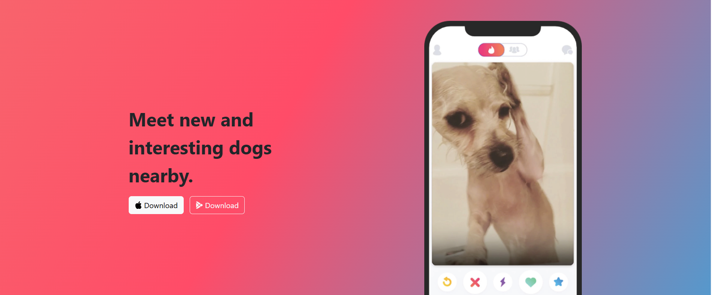
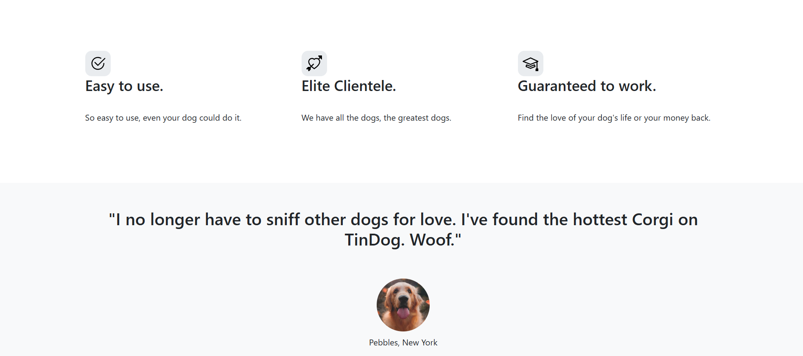
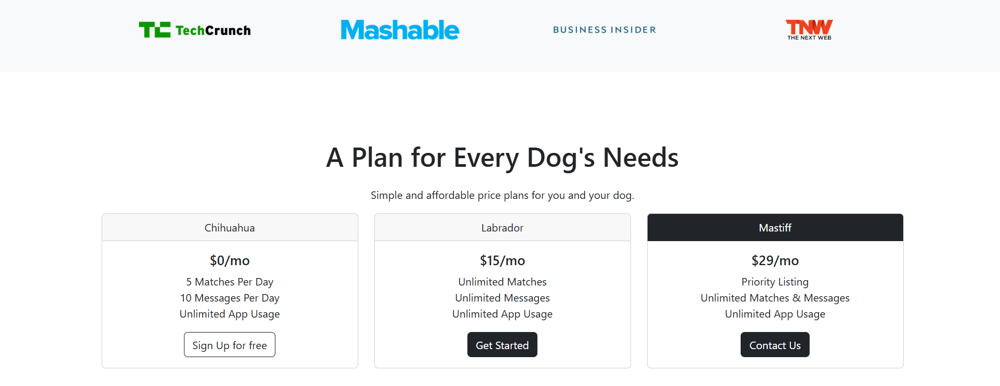

# 🐾 Akamaru Dog Website (TinDog Project)

A fun and responsive landing page for dog lovers inspired by Tinder – but for dogs! 🐶  
Built using **HTML, CSS, and Bootstrap**.  

---

## 📸 Screenshots

### Homepage


### Page 2


### Page 3


### Page 4


---

## ✨ Features
- 🎨 Clean & modern UI  
- 📱 Fully responsive (mobile, tablet, desktop)  
- 🐕 "Tinder for Dogs" inspired theme  
- 🔥 Bootstrap components (carousel, grid, buttons, etc.)  

---

## 🛠️ Tech Stack
- **HTML5**
- **CSS3**
- **Bootstrap 5**

---

## 🚀 Getting Started

Clone the repo:

```bash
git clone https://github.com/devaki001/Akamaru-dog-website.git
cd Akamaru-dog-website
